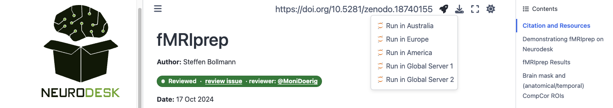

# awesome-pRF

A curated collection of tools and resources for population Receptive Field (pRF) mapping, organised by experiment stage — from stimulus design to data reporting. Companion repository to the manuscript *"Population Receptive Field Mapping: Methods, Challenges, and Insights"*.

## Contents

1. [Visual Stimulus](01_visual_stimulus/resources.md)
2. [Scanning](02_scanning/resources.md)
3. [Preprocessing](03_preprocessing/resources.md)
4. [pRF Model Fitting](04_prf_model_fitting/resources.md)
5. [Software Tools](05_software_tools/resources.md)
6. [Pilot Testing](06_pilot_testing/resources.md)
7. [Retinotopic Organisation and Visual Areas](07_retinotopic_organisation_and_visual_areas/resources.md)
8. [Reporting Standards](08_reporting_standards/resources.md)

## Running tutorials with Neurodesk

Several of the tutorials linked throughout this repository are available via [Neurodesk](https://www.neurodesk.org/), a platform that provides containerised neuroimaging tools in a reproducible environment. These tutorials are part of the [NeurodeskEDU](https://neurodesk.org/edu/), Neurodesk’s education and learning resources.

### Try it in your browser

The quickest way to get started is through Neurodesk's free cloud resources, [Neurodesk Play](https://neurodesk.org/getting-started/hosted/play/) — no installation required. You can run any of the linked Neurodesk tutorials directly in your web browser by clicking on the rocket in the top right menu, making it an ideal entry point for getting familiar with the tools used in pRF mapping.

### Prototype locally with the Neurodesk App

For local development, [Neurodesk App](https://neurodesk.org/getting-started/local/neurodeskapp/) provides a full graphical desktop environment (GUI) on your own computer. This allows you to interactively prototype and test your analysis pipelines before committing to large-scale runs.

### Scale to HPC

Once your pipeline is ready, Neurodesk's command-line interface, [Neurocommand](https://neurodesk.org/getting-started/neurocommand/) makes it straightforward to port your workflows to a High-Performance Computing (HPC) cluster — the same containerised tools run identically across environments, from your laptop to institutional compute infrastructure.

### Contribute tutorials to NeurodeskEDU

If you have a pRF-related workflow or tool tutorial you'd like to share, you can contribute it directly to [NeurodeskEDU](https://neurodesk.org/edu/). Contributions are Jupyter Notebooks submitted via pull request to the [neurodeskedu repository](https://github.com/neurodesk/neurodeskedu).

- **Template**: Start from the official [example notebook template](https://neurodesk.org/edu/contribute/examples.html) to ensure your notebook follows the expected structure.
- **Automated testing**: Every submitted notebook is automatically executed via GitHub Actions to verify it runs correctly end-to-end.
- **Peer review**: Notebooks go through a [review process](https://neurodesk.org/edu/contribute/review.html) where reviewers assess content quality and educational value. Reviewers complete assessments within 2 weeks, and contributors are expected to respond to feedback within 1 week.
- **DOI assignment**: Each accepted tutorial is assigned a DOI, making it a citable scholarly contribution. For more details, see the [NeurodeskEDU preprint](https://osf.io/preprints/edarxiv/7q83c).

Once merged, your tutorial becomes immediately available to anyone using Neurodesk Play or the Neurodesk App, and you are acknowledged on the NeurodeskEDU Contributors page.

### References

- Renton, A.I., et al. (2024). Neurodesk: an accessible, flexible and portable data analysis environment for reproducible neuroimaging. *Nature Methods*. [https://doi.org/10.1038/s41592-023-02145-x](https://doi.org/10.1038/s41592-023-02145-x)
- Dörig, M., et al. (2026). Developing an Interactive Neuroimaging Education Resource with Neurodesk. *EdArXiv*. [https://doi.org/10.35542/osf.io/7q83c_v1](https://doi.org/10.35542/osf.io/7q83c_v1)